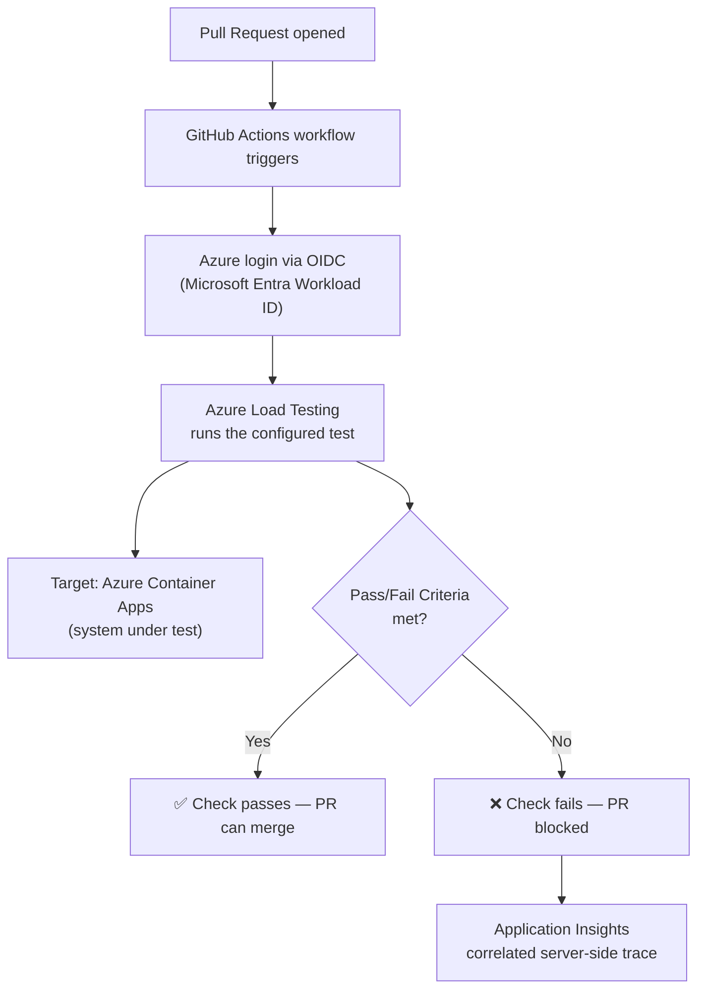

# Automate Azure Load Testing Using GitHub Actions

A production-shaped lab that wires **Azure Load Testing** into a **GitHub Actions** pipeline so every pull request gets an automated, pass/fail-gated performance test — authenticated via Microsoft Entra Workload ID federation (OIDC), with zero stored secrets.

Companion lab for the article [Automate Azure Load Testing Using GitHub Actions](https://raphaelgmomoh.pages.dev/articles/automate-azure-load-testing-github-actions), built on the pattern in Microsoft's [Automate Azure Load Testing by using GitHub Actions](https://learn.microsoft.com/en-us/credentials/applied-skills/automate-azure-load-testing-by-using-github-actions/) Applied Skills path.

---

## Architecture



---

## Repository Structure

```text
.
├── README.md
├── .github/
│   └── workflows/
│       ├── load-test.yml          # PR-triggered load test workflow (OIDC auth)
│       └── load-test-push.yml     # Push-to-main variant — same job, different trigger + OIDC subject
├── loadtest-config.yaml           # URL-based test definition + pass/fail criteria
└── src/
    ├── bicep/
    │   └── main.bicep             # Provisions the Azure Load Testing resource + RBAC
    └── python/
        ├── check_run.py           # Standalone script to poll a test run's pass/fail state
        └── requirements.txt
```

---

## Quick Start

### 1. Provision the Azure Load Testing resource (Bicep)

```bash
az deployment group create \
  --resource-group rg-payments-perf \
  --template-file src/bicep/main.bicep \
  --parameters loadTestName=payments-api-loadtest principalId=<your-service-principal-object-id>
```

### 2. Configure OIDC federation + repo variables

See the [article](https://raphaelgmomoh.pages.dev/articles/automate-azure-load-testing-github-actions) for the full `az ad app` / `gh variable set` walkthrough — summarized:

```bash
az ad app create --display-name "payments-api-loadtest-gha"
export APP_ID=$(az ad app list --display-name "payments-api-loadtest-gha" --query "[0].appId" -o tsv)
az ad sp create --id "$APP_ID"

az ad app federated-credential create --id "$APP_ID" --parameters '{
  "name": "github-actions-pr",
  "issuer": "https://token.actions.githubusercontent.com",
  "subject": "repo:YOUR_ORG/YOUR_REPO:pull_request",
  "audiences": ["api://AzureADTokenExchange"]
}'
```

The `pull_request` subject only covers the workflow in `load-test.yml`. If you also want the push-to-main variant (`load-test-push.yml`) to authenticate, it needs its own federated credential — the OIDC subject claim for a `push` trigger is the branch ref, not `pull_request`:

```bash
az ad app federated-credential create --id "$APP_ID" --parameters '{
  "name": "github-actions-push-main",
  "issuer": "https://token.actions.githubusercontent.com",
  "subject": "repo:YOUR_ORG/YOUR_REPO:ref:refs/heads/main",
  "audiences": ["api://AzureADTokenExchange"]
}'

gh variable set AZURE_CLIENT_ID --body "$APP_ID"
gh variable set AZURE_TENANT_ID --body "$(az account show --query tenantId -o tsv)"
gh variable set AZURE_SUBSCRIPTION_ID --body "$(az account show --query id -o tsv)"
```

### 3. Open a pull request

The workflow in `.github/workflows/load-test.yml` runs automatically and posts a pass/fail check against the thresholds in `loadtest-config.yaml`.

### 4. (Optional) Check a run's result locally

```bash
cd src/python
pip install -r requirements.txt
python check_run.py --test-id payments-api-pr-check
```

---

## Alternative: client-secret auth instead of OIDC

Everything above uses OIDC (Microsoft Entra Workload ID federation) — no stored secrets, the recommended path. If your setup can't use OIDC (an older `azure/login@v1`-only integration, or a runner that can't request a federated token), `scripts/create-service-principal-secret.sh` creates a classic service principal with a client secret instead:

```bash
./scripts/create-service-principal-secret.sh payments-api-loadtest-gha-secret rg-payments-perf
gh secret set AZURE_CREDENTIALS --body '<the JSON the script prints>'
```

Then swap `azure/login@v2` (client-id/tenant-id/subscription-id) for `azure/login@v1` with `creds: ${{ secrets.AZURE_CREDENTIALS }}` in the workflow. This path stores a real secret in GitHub — rotate it periodically; OIDC has no equivalent rotation burden, which is why it's the default here.

---

## License

MIT — use it, fork it, adapt it to your own pipeline.
